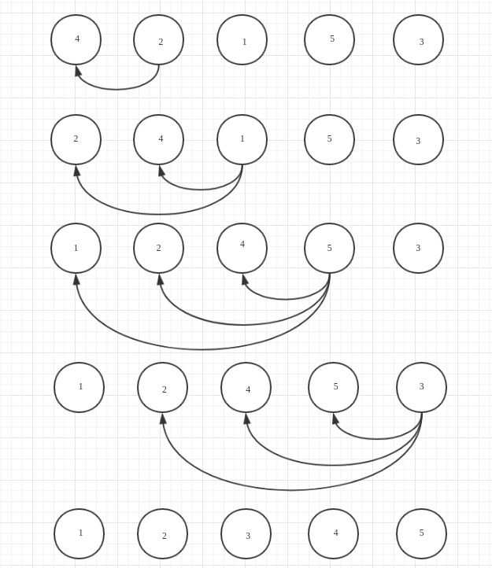

[TOC]

# 排序

## 插入排序

从数组中下标为1的开始到数组最后一个数字。每一个数字都与其前面的数字依次进行比较，直到找到合适的位置，将其插进去。

### 图示



### 代码

```java
public class InsertSort {
    private int[] insertSort(int[] arr) {
        for (int i = 1; i < arr.length; i++) {
            int key = arr[i];
            int j = i - 1;
            while (j >= 0 && (key < arr[j])) {
                arr[j + 1] = arr[j];
                j--;
            }
            arr[j + 1] = key;
        }
        return arr;
    }

    public static void main(String[] args) {
        InsertSort insertSort = new InsertSort();
        int[] arr = {10, 2, 3, 5, 1};
        System.out.println(Arrays.toString(insertSort.insertSort(arr)));
    }
}
```

